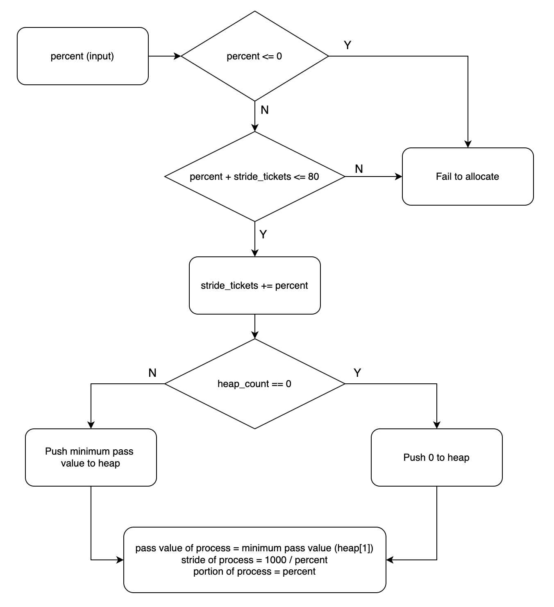
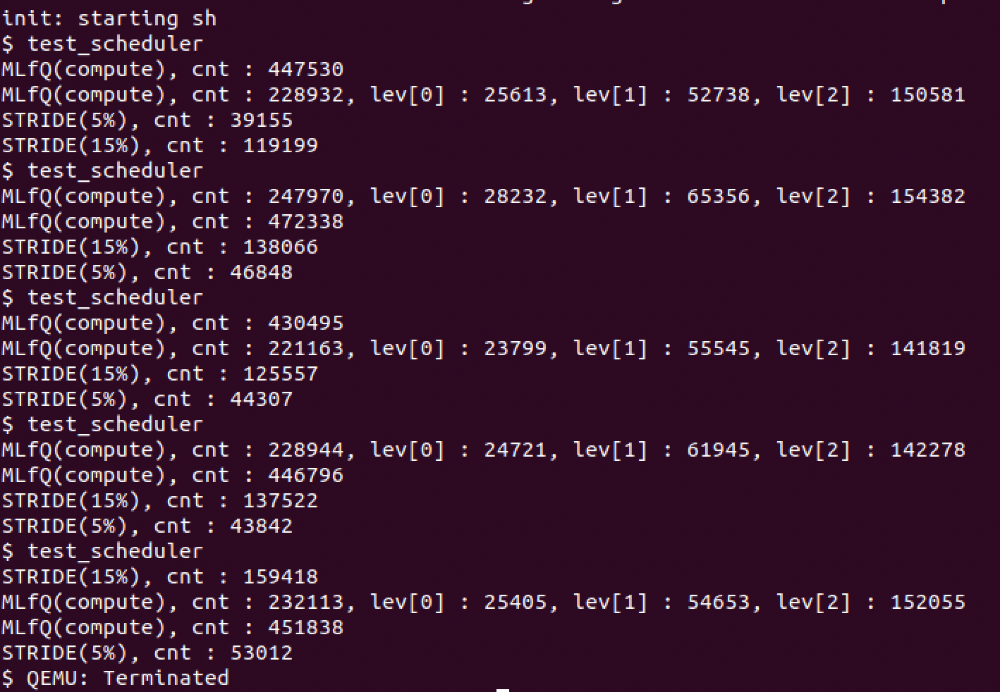
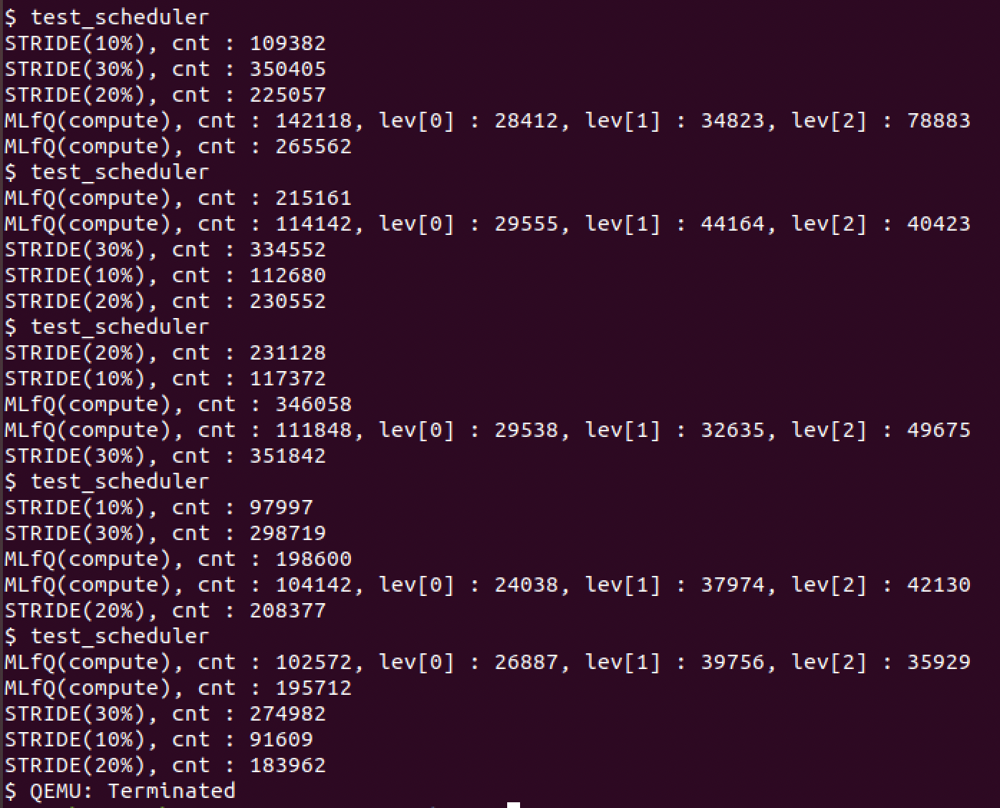
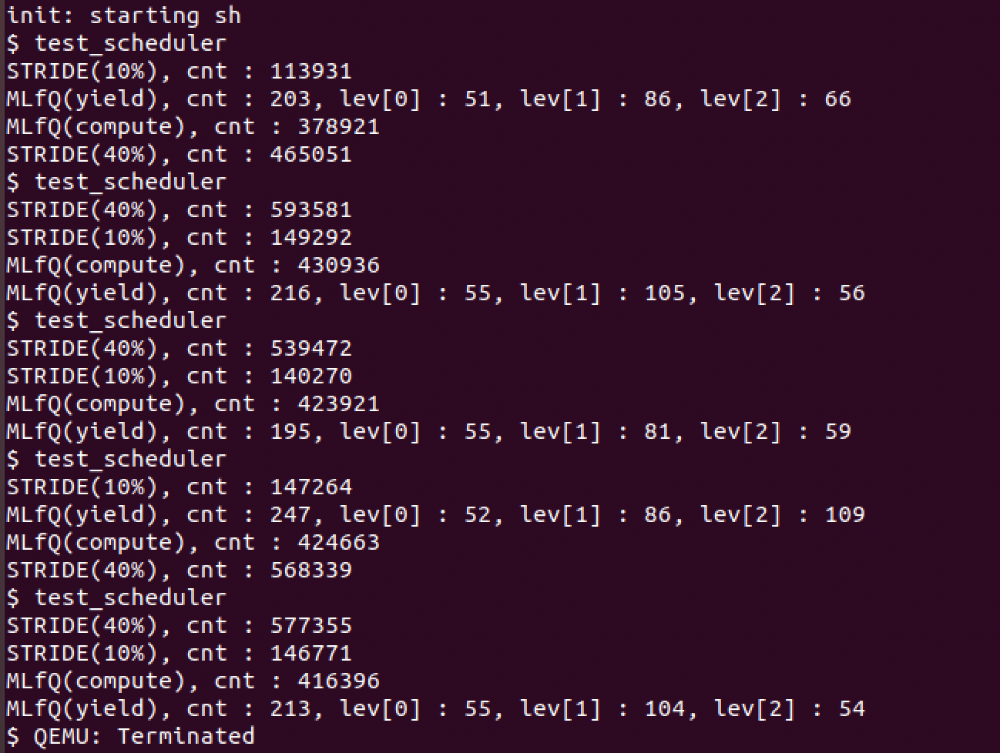
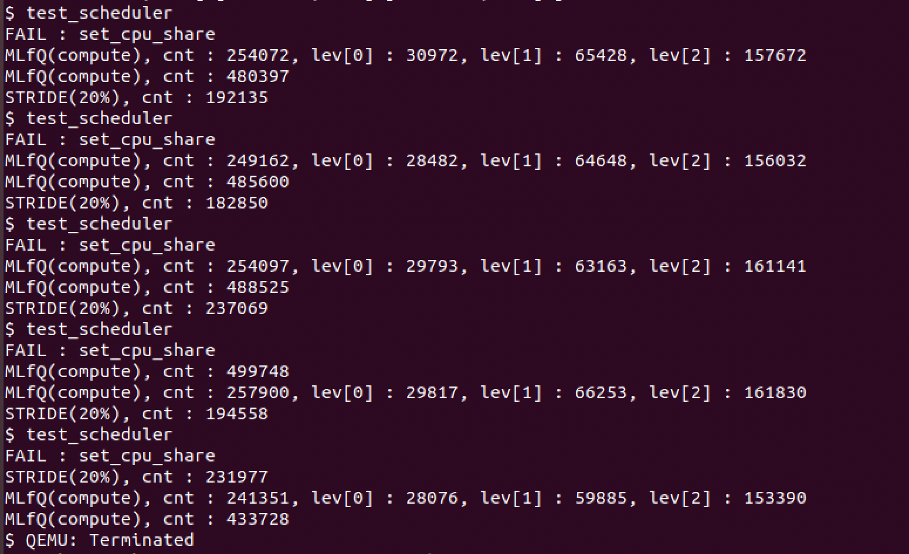

# Introduction

In this project, I am going to introduce a new process scheduler for xv6 by combining MLFQ with Stride Scheduling.

---

# Milestone 1

## 1. MLFQ

In struct proc, six more variables will be added, which are _level_, _ticks_, _runtime_, _pass_value_, _stride_, and _portion_.

- _level_ is the priority level of the process which is one of 0, 1, and 2.
- _ticks_ is the number of ticks passed while the process is running. It is used to check against the designated time quantum. If the time quantum has passed, the process yields.
- _runtime_ indicates the amount of CPU time spent by the process, and if it exceeds the designated time allotment, the process moves to the lower level in MLFQ.
- _pass_value_ shows the pass value of the process that is under stride scheduling. If the process is under MLFQ scheduling, its pass value is -1.
- _stride_ is the stride of the process under stride scheduling. It is calculated as 1000 / (number of tickets allocated to the process).
- _portion_ is the number of tickets allocated to the process.

```c
struct proc {
    ...
    int level;          // Priority Level
    int ticks;          // To check with time quantum.
    int runtime;        // To check total ticks to see if process has used up its allotment.
    int pass_value;     // Pass value for stride scheduling (-1 if process is under MLFQ scheduling)
    int stride;         // stride = 1000 / allocated tickets
    int portion;        // allocated tickets
};
```

Below is a simple description of how MLFQ works.

1. The scheduler searches for the next process to be executed starting from level 0.
2. If found, the scheduler runs the process.
3. If not found, the scheduler searches for a level 1 process, and runs the process if found.
4. If not found, the scheduler searches for a level 2 process, and runs the process.
5. Once a process is run by the scheduler, the process yields after its time quantum passes. The time quantum depends on the process's level.
6. After a process yields, the scheduler goes back to step 1 and searches for the next process to execute.
7. If a process uses up its time allotment (this can be checked by the _runtime_ variable), its priority level is lowered. The time allotment also depends on the process's level. However, level 2 processes do not have a time allotment since they are at the lowest level.
8. To prevent starvation, priority boost is performed every 100 ticks. This elevates all processes to level 0.
9. To prevent a process from gaming the scheduler, a tick will be incremented if the process yields before it uses up its time allotment.

Time Quantum for each level:

- Level 0 : 1 tick
- Level 1 : 2 ticks
- Level 2 : 4 ticks

Time Allotment for each level:

- Level 0 : 5 ticks
- Level 1 : 10 ticks

---

## 2. Combining Stride Scheduling

Stride scheduling will be implemented using min heap. The heap will contain processes that invoked set_cpu_share(), which is a system call requesting a certain amount of CPU share. Processes will have their own pass values, and the one with the minimum pass value will be selected from the heap.

The stride of each process will be calculated based on how much CPU share it has requested. The equation is as follows.  
_Stride = 1000 / Amount of CPU share requested_

Every time a process is selected by stride scheduling, its pass value is updated by the following equation.  
_New Pass value = Old Pass value + Stride_  
(Initial pass value will be set to the minimum pass value in the heap to prevent monopolization of newly created process.)

Below is a simple description of how Stride Scheduling is combined with MLFQ.

1. A newly created process first enters MLFQ scheduling, and is given level 0 priority.
2. If the process invokes set*cpu_share(), the scheduler will first check if *(the requested amount + the amount of CPU share already allocated by stride scheduling)\_ exceeds 80% of the total CPU share.

- If it exceeds 80% of the total CPU share, the request is ignored.
- If it does not exceed 80% of the total CPU share, the scheduler allocates the requested amount of CPU share to the process. The process's pass value is initialized as the minimum pass value, and its pass value is pushed into the heap.

3. Now the process is controlled by stride scheduling not MLFQ scheduling, therefore whether it is executed or not depends on its pass value. The process is selected if it has the minimum pass value. The heap is popped and the process' pass value is updated by the equation written above.

---

# Milestone 2

## 1. Implementation

### a) Initialization

First, as written in Milestone 1, the necessary variables are added to the proc structure in proc.h.

```c
struct proc {
    ...
    int level;          // Priority Level
    int ticks;          // To check with time quantum.
    int runtime;        // To check total ticks to see if process has used up its allotment.
    int pass_value;     // Pass value for stride scheduling (-1 if process is under MLFQ scheduling)
    int stride;         // stride = 1000 / allocated tickets
    int portion;        // allocated tickets
};
```

Then, arrays for time allotment and time quantum are defined, as well as the number of tickets allocated for stride scheduling. Also, an array for heap is defined for stride scheduling. This heap contains the pass values of processes under stride scheduling. The functions for heap such as push and pop will not be explained here as they are generic algorithms.  
The variables below are defined in proc.c.

```c
int allotment[2] = {5, 10};    // Array to check if process has used up its allotment.
int quantum[3] = {1, 2, 4};    // Array to check process's ticks with its time quantum.
int stride_tickets = 0;        // Tickets allocated for stride scheduling. Initially 0.

// Heap for stride scheduling.
int heap[NPROC + 1];
int heap_count = 0;
```

To correctly initialize each process, the allocproc function is modified as below.  
The most important part here is initializing the level to 0 and the pass_value to -1. When a process is newly created, it is first under MLFQ scheduling and is given the highest priority. Therefore its level is 0 and its pass_value is -1 since it is not under stride scheduling.

```c
static struct proc*
allocproc(void)
{
  struct proc *p;
  char *sp;

  acquire(&ptable.lock);

  for(p = ptable.proc; p < &ptable.proc[NPROC]; p++)
    if(p->state == UNUSED)
      goto found;

  release(&ptable.lock);
  return 0;

found:
  p->state = EMBRYO;
  p->pid = nextpid++;
  p->level = 0;         // Process is initially given the highest priority.
  p->ticks = 0;         // Initialize ticks.
  p->runtime = 0;       // Initialize runtime.
  p->pass_value = -1;   // Process initially enters MLFQ. (If pass_value > 0, process is in stride scheduling.)
  p->stride = 0;        // Initialize stride.
  p->portion = 0;       // Initialize number of tickets allocated.

  release(&ptable.lock);
  ...
```

---

### b) Main Algorithm

The diagram below is the algorithm of my scheduler.


In my implementation, the total number of tickets is 100. The stride scheduling portion of these tickets is _stride_tickets_, and the rest are for MLFQ scheduling. A _count_ variable is defined to check if _count_ is smaller or bigger than _stride_tickets_ to determine whether to choose MLFQ or stride scheduling. _count_ repeats incrementing from 1 to 100. While _count_ is smaller or equal to _stride_tickets_, stride scheduling is performed, and MLFQ scheduling otherwise. This way, the ratio of stride and MLFQ scheduling matches the proportion of tickets allocated to each scheduling method.

Additionally, _found_ and _sched_ticks_ are declared. _found_ is used for MLFQ scheduling to check if there is a higher level process which is runnable. _sched_ticks_ is an internal tick used for the scheduler. For every 1000 internal ticks, the scheduler runs the process without any condition. This is implemented to prevent the scheduler from falling into an infinite loop.

```c
void
scheduler(void)
{
    struct proc *p;
    struct cpu *c = mycpu();
    c->proc = 0;

    struct proc *q;
    int found;                  // Check if there is a higher level process which is runnable.
    int sched_ticks = 0;        // Internal tick used for scheduler.
    int count = 0;              // Check count to ensure ratio of stride and MLFQ scheduling.

    for(;;){
        // Enable interrupts on this processor.
        sti();

        // Loop over process table looking for process to run.
        acquire(&ptable.lock);
        for(p = ptable.proc; p < &ptable.proc[NPROC]; p++) {
            if(p->state != RUNNABLE)
                continue;

            // Execute process every 1000 ticks to avoid infinite loop.
            if(++sched_ticks > 1000) {
                sched_ticks = 1;
                goto execution;
            }

            if(++count > 100)       // Count up to 100, then go back to 1.
                count = 1;          // This is because there are total 100 tickets to distribute.
```

If _count_ is smaller than or equal to _stride_tickets_, stride scheduling is performed.  
If the heap is not empty and the pass value of the process is the minimum pass value(heap[1]), the heap is popped. The pass value of the process is updated by adding its stride, and the updated pass value is pushed back to the heap. Then, the process is executed right away.  
If the condition is not met, _count_ is decremented and the scheduler moves on to the next process. Here, the _count_ is decremented because _count_ should remain the same until a process to execute is found.

```c
            // Use stride scheduling while count is smaller than tickets allocated to stride scheduling.
            if(count <= stride_tickets) {
                // Execute process if its pass_value == heap[1], meaning it has the minimum pass_value.
                // Pop the value from the heap, then push the newly updated pass_value.
                if( (heap_count > 0) && (p->pass_value == heap[1]) ) {
                    pop();
                    p->pass_value += p->stride;
                    push(p->pass_value);
                    goto execution;
                }
                // If the process is not under stride scheduling or does not have the minimum pass_value,
                // decrement count and continue searching.
                else {
                    count--;
                    continue;
                }
            }
```

If _count_ is bigger than _stride_tickets_, then MLFQ scheduling is performed.  
If the pass value of the process is not -1, then it means the process is under stride scheduling. Therefore, _count_ is decremented and the scheduler moves on to the next process.
If the pass value is -1 and the level is 0, the process is executed.  
If the pass value is -1 but the level is 1 or 2, the scheduler searches for a runnable higher level process with pass value -1. If such a process is found, _count_ is decremented and the scheduler moves on. If not found, then the process is executed.

```c
            // If count is above stride_tickets, search for mlfq processes.
            // mlfq processes have -1 as their pass_value.
            if(p->pass_value != -1) {
                count--;
                continue;
            }

            // If process's level is 0, it is executed. Otherwise, the scheduler searches for higher level processes.
            if(p->level > 0) {
                found = 0;
                for(q = ptable.proc; q < &ptable.proc[NPROC]; q++) {
                    if( (q->state == RUNNABLE) && (q->pass_value == -1) && (q->level < p->level) ) {
                        found = 1;
                        break;
                    }
                }
                // If a higher level mlfq process is found, the scheduler decrements the count and continues searching.
                if(found == 1) {
                    count--;
                    continue;
                }
            }

execution:
            // Switch to chosen process.  It is the process's job
            // to release ptable.lock and then reacquire it
            // before jumping back to us.
            c->proc = p;
            ...
```

---

### c) Added Functions

#### priority_boost (proc.c)

```c
void
priority_boost(void)
{
    struct proc *p;

    // Loop over ptable and change every process's level to 0.
    // Also initialize ticks and runtime to 0.
    acquire(&ptable.lock);
    for(p = ptable.proc; p < &ptable.proc[NPROC]; p++) {
        p->level = 0;
        p->ticks = 0;
        p->runtime = 0;
    }
    release(&ptable.lock);
}
```

This function loops through the ptable and initializes the level, ticks, and runtime to 0.

```c
void
trap(struct trapframe *tf)
{
  ...
  switch(tf->trapno){
  case T_IRQ0 + IRQ_TIMER:
    if(cpuid() == 0){
      acquire(&tickslock);
      ticks++;
      if(ticks % 100 == 0)
          priority_boost();         // Priority boost every 100 ticks.
      wakeup(&ticks);
      release(&tickslock);
    }
    lapiceoi();
    break;
  ...
```

Priority boost is executed in the _trap_ function in trap.c. For every 100 ticks, the _priority_boost()_ function is called.

#### set_cpu_share (proc.c)



```c
// Request for CPU time under stride scheduling.
int
set_cpu_share(int percent)
{
    if(percent <= 0)      // Percent cannot be less than or equal to 0.
        return -1;

    // Only allocate share if total tickets allocated to stride scheduling does not exceed 80.
    if( (percent + stride_tickets) <= 80 ) {
        stride_tickets += percent;
        if(heap_count == 0)         // Push 0 if heap is empty.
            push(0);
        else                        // else, push minimum pass value to heap.
            push(heap[1]);
        myproc()->pass_value = heap[1];         // Process is given the minimum pass value as its pass value.
        myproc()->stride = 1000 / percent;      // Stride is calculated as (1000 / allocated tickets).
        myproc()->portion = percent;            // Save the number of tickets allocated.
        return 0;
    }
    // If total allocated tickets exceed 80, return -1.
    else
        return -1;
}
```

This function passes _percent_ as its argument. _percent_ represents the percentage of CPU share requested by the process. Since the total tickets is 100 for my implementation, _percent_ becomes the number of tickets requested. If _percent_ added by _stride_tickets_ is equal to or less than 80, request is permitted. _stride_tickets_ is updated by adding _percent_. If the heap is empty, 0 is pushed. Otherwise, the minimum pass value is pushed again. Then, the minimum pass value is assigned to the process. The stride of the process is assigned as 1000 / _percent_, and _portion_ is used to save the number of tickets allocated.

#### sys_set_cpu_share (sysproc.c)

```c
int
sys_set_cpu_share(void)
{
    int percent;
    if(argint(0, &percent) < 0)
        return -1;
    return set_cpu_share(percent);
}
```

This is the wrapper function for the _set_cpu_share_ function. It passes _percent_ to the _set_cpu_share_ function.

#### sys_yield (sysproc.c)

```c
int
sys_yield(void)     // This function is called when user calls yield(), not timer interrupt.
{
    if(myproc()) {
        // Increment ticks and runtime.
        myproc()->ticks++;
        myproc()->runtime++;
        // If the process's level is lower than 2 and its runtime reaches its allotment, increment its level.
        if( (myproc()->level < 2) && (myproc()->runtime >= allotment[myproc()->level]) ) {
            myproc()->level++;
            myproc()->runtime = 0;
            myproc()->ticks = 0;
        }
    }
    yield();
    return 0;
}
```

This wrapper function is called when the process(user) calls _yield()_ before a tick is done. To prevent gaming the scheduler problem, the ticks and runtime of the process are incremented. Then, if the process is in either level 0 or 1 and its runtime exceeds its time allotment, its level is incremented and its runtime and ticks are initialized to 0. This way, the process cannot stay in the highest level even if it yields before a tick is done.

#### sys_getlev (sysproc.c)

```c
int
sys_getlev(void)
{
    // Return level if process is in MLFQ mode.
    if(myproc()->pass_value == -1)
        return myproc()->level;
    // Otherwise return a negative value.
    else
        return -1;
}
```

This function returns the level of the process in MLFQ. It first checks if the process's pass value is -1 to see whether the process is under MLFQ or stride scheduling. If it is -1, the level of the process is returned. Otherwise, -1 is returned.

---

### d) Additional code

#### Handling Timer Interrupt

```c
void
trap(struct trapframe *tf)
{
  ...
  // Force process to give up CPU on clock tick.
  // If interrupts were on while locks held, would need to check nlock.
  if(myproc() && myproc()->state == RUNNING &&
     tf->trapno == T_IRQ0+IRQ_TIMER) {
      // Increment ticks and runtime.
      myproc()->ticks++;
      myproc()->runtime++;
      if(myproc()->pass_value != -1) {     // If process is in stride mode, yield every 2 ticks.
          if(myproc()->ticks >= 2) {
              myproc()->ticks = 0;
              myproc()->runtime = 0;
              yield();
          }
      }
      else if(myproc()->ticks >= quantum[myproc()->level]) {    // If process is in MLFQ mode, yield only if quantum has passed.
          myproc()->ticks = 0;
          // Increment process's level if its runtime becomes the same or bigger than its allotment.
          // Only for processes in level 0 and 1.
          if( (myproc()->level < 2) && (myproc()->runtime >= allotment[myproc()->level]) ) {
              myproc()->level++;
              myproc()->runtime = 0;
          }
          yield();
      }
  }
  ...
```

When a timer interrupt occurs, this if statement is executed in the _trap_ function. First, the ticks and runtime of the process are incremented by 1.  
Then, if the pass value is not -1 (meaning the process is under stride scheduling), check if 2 ticks has passed. If 2 ticks has passed, initialize the ticks and runtime to 0, and call _yield()_. Here, the time quantum is set to 2 ticks to match the time quantum in MLFQ. In MLFQ scheduling, the time quantum are 1 tick, 2 ticks, and 4 ticks depending on the level, therefore the average ticks is (1 + 2 + 4) / 3 = 2.33 ticks. Hence, the time quantum for stride scheduling is set to 2 ticks.  
If the pass value is -1 the process is under MLFQ scheduling. Check if the ticks is equal to or bigger than the time quantum. The time quantum array is used to get the time quantum for the process's level. If the time quantum has passed, the ticks is initialized to 0. Then, if the process's level is less than 2 and its runtime is equal to or bigger than the time allotment, the level of the process is incremented by 1 and its runtime is initialized to 0. The time allotment array is used to get the time allotment for the process's level. Finally, the process calls _yield()_.

#### Handling Exit

```c
void
exit(void)
{
  struct proc *curproc = myproc();
  struct proc *p;
  int fd;

  if(curproc == initproc)
    panic("init exiting");

  // If exiting process is under stride scheduling, return its portion.
  if( (curproc->pid > 0) && (curproc->pass_value != -1) ) {
      pop();
      stride_tickets -= curproc->portion;
  }
  ...
```

When a process exits, this _exit_ function is called. Processes under stride scheduling must pop from the heap and return their portion of tickets back to MLFQ scheduling. This function checks if the exiting process's pass value is not -1 (and its pid should be bigger than 0). If the condition is met it pops from the heap and decrements _stride_tickets_ by the number of tickets allocated to the process.

## 2. Evaluation

### 1) Test with 5%, 15% Stride scheduling (process does not yield itself)




|             |       1st       |       2nd       |       3rd       |       4th       |       5th       |     Average     |
| ----------- | :-------------: | :-------------: | :-------------: | :-------------: | :-------------: | :-------------: |
| Stride(5%)  |  39,155 (4.7%)  |  46,848 (5.2%)  |  44,307 (5.4%)  |  43,842 (5.1%)  |  53,012 (5.9%)  |  45,433 (5.3%)  |
| Stride(15%) | 119,199 (14.3%) | 138,066 (15.3%) | 125,557 (15.3%) | 137,522 (16.0%) | 159,418 (17.8%) | 135,952 (15.8%) |
| MLFQ        | 676,462 (81.0%) | 720,308 (79.6%) | 651,658 (79.3%) | 675,740 (78.8%) | 683,951 (76.3%) | 681,624 (79.0%) |
| Total       |     834,816     |     905,222     |     821,522     |     857,104     |     896,381     |     863,009     |

To start with, the scheduler is tested with 5% and 15% (total 20%) stride scheduling combined with MLFQ. The process does not yield itself in this test. The counts for MLFQ_LEVCNT and MLFQ_NONE are aggregated to show the total counts for MLFQ. The tests are done 5 times consecutively. The average result at the rightmost column shows the percentage initially requested by each stride process quite accurately matches the percentage actually allocated to each stride process. Also, the ratio between stride and MLFQ scheduling appears as expected, with MLFQ processes having about 79% of the CPU share and stride processes having 21%.

|                   |       1st       |       2nd       |       3rd       |       4th       |       5th       |     Average     |
| :---------------: | :-------------: | :-------------: | :-------------: | :-------------: | :-------------: | :-------------: |
|      Level 0      | 25,613 (11.2%)  | 28,232 (11.4%)  | 23,799 (10.8%)  | 24,721 (10.8%)  | 25,405 (10.9%)  | 25,554 (11.0%)  |
|      Level 1      | 52,738 (23.0%)  | 65,356 (26.4%)  | 55,545 (25.1%)  | 61,945 (27.1%)  | 54,653 (23.5%)  | 58,047 (25.0%)  |
|      Level 2      | 150,581 (65.8%) | 154,382 (62.3%) | 141,819 (64.1%) | 142,278 (62.1%) | 152,055 (65.5%) | 148,223 (63.9%) |
|       TOTAL       |     228,932     |     247,970     |     221,163     |     228,944     |     232,113     |     231,824     |
| Level 1 / Level 0 |      2.06       |      2.31       |      2.33       |      2.51       |      2.15       |      2.27       |

Lets take a closer look at the counts of each level in MLFQ scheduling. Since the time allotment for level 0 and level 1 are 5 ticks and 10 ticks respectively, the percentage of level 1 processes should be twice the percentage of level 0 processes. The result shows the count for level 1 processes is about 2.27 times the count for level 0 processes, meaning the scheduler worked as expected. Also, since level 2 processes do not have a time allotment, they are expected to have the highest percentage among the 3 levels. As expected, level 0 processes have the lowest percentage and level 2 processes have the highest percentage, and the ratio of each level is consistent for all 5 tests.

### 2) Test with 10%, 20%, 30% Stride scheduling (process does not yield itself)



|             |       1st       |       2nd       |       3rd       |       4th       |       5th       |     Average     |
| ----------- | :-------------: | :-------------: | :-------------: | :-------------: | :-------------: | :-------------: |
| Stride(10%) | 109,382 (10.0%) | 112,680 (11.2%) | 117,372 (10.1%) | 97,997 (10.8%)  | 91,609 (10.8%)  | 105,808 (10.6%) |
| Stride(20%) | 225,057 (20.6%) | 230552 (22.9%)  | 231,128 (20.0%) | 208,377 (23.0%) | 183,962 (21.7%) | 215,815 (21.5%) |
| Stride(30%) | 350,405 (32.1%) | 334552 (33.2%)  | 351,842 (30.4%) | 298,719 (32.9%) | 274,982 (32.4%) | 322,100 (32.1%) |
| MLFQ        | 407,680 (37.3%) | 329303 (32.7%)  | 457906 (39.5%)  | 302,742 (33.3%) | 298,284 (35.1%) | 359,183 (35.8%) |
| Total       |    1,092,524    |    1,007,087    |    1,158,248    |     907,835     |     848,837     |    1,002,906    |

This time the scheduler is tested with 10%, 20%, 30% (total 60%) stride scheduling combined with MLFQ. The process does not yield itself in this test. The counts for MLFQ_LEVCNT and MLFQ_NONE are aggregated to show the total counts for MLFQ. The tests are done 5 times consecutively. The average result at the rightmost column shows the percentage initially requested by each stride process quite accurately matches the percentage actually allocated to each stride process. Also, the ratio between stride and MLFQ scheduling appears as expected but with some degree of error. It appears MLFQ processes have about 36% of the CPU share while stride processes have 64%.

### 3) Test with 10%, 40% Stride scheduling (process yields itself)



|                   |       1st       |       2nd       |       3rd       |       4th       |       5th       |     Average     |
| :---------------: | :-------------: | :-------------: | :-------------: | :-------------: | :-------------: | :-------------: |
|    Stride(10%)    | 113,931 (11.9%) | 149,292 (12.7%) | 140,270 (12.7%) | 147,264 (12.9%) | 146,771 (12.9%) | 139,506 (12.6%) |
|    Stride(40%)    | 465,051 (48.5%) | 593,581 (50.6%) | 539,472 (48.9%) | 568,339 (49.8%) | 577,355 (50.6%) | 548,760 (49.7%) |
| MLFQ_LEVCNT_YIELD |   203 (0.02%)   |   216 (0.02%)   |   195 (0.02%)   |   247 (0.02%)   |   213 (0.02%)   |   215 (0.02%)   |
|     MLFQ_NONE     | 378,921 (39.5%) | 430,936 (36.7%) | 423,921 (38.4%) | 424,663 (37.2%) | 416,396 (36.5%) | 414,967 (37.6%) |
|    MLFQ Total     | 379,124 (39.6%) | 431,152 (36.7%) | 424,116 (38.4%) | 424,910 (37.3%) | 416,609 (36.5%) | 415,182 (37.6%) |
|       Total       |     958,106     |    1,174,025    |    1,103,858    |    1,140,513    |    1,140,735    |    1,103,448    |

The scheduler is tested with 10%, 40% (total 50%) stride scheduling combined with MLFQ. The process yields itself in this test. The counts for MLFQ*LEVCNT_YIELD and MLFQ_NONE are shown separately this time. The tests are done 5 times consecutively. The average result at the rightmost column shows the percentage initially requested by each stride process does not accurately match the percentage actually allocated to each stride process. The process that requested 10% actually appears to have 12.6%, which is moderately accurate, but the process that requested 40% actually got 49.7%, which is a bit bigger than requested. Overall, the ratio between stride and MLFQ processes is about 62:38, when it should be 50:50. The reason for this error appears to be the voluntary yield called by the processes. Since the processes call yield before its time quantum has passed, they tend to run shorter than normal circumstances where yield is not called voluntarily. Also, to prevent \_gaming the scheduler* problem, a tick is incremented if a process yields by itself. By doing this, the process cannot stay in the highest level forever, thus moves down to lower levels. Therefore, it is assumed that the voluntary yield by processes caused the percentage of CPU share of MLFQ processes to be lower than 50%.  
However, the ratio between the 10% and 40% stride processes is about 1:4, meaning the switch between stride processes were done properly.

### 4) Test with 20%, 65% Stride scheduling (process does not yield itself)



|             |       1st       |       2nd       |       3rd       |       4th       |       5th       |     Average     |
| :---------: | :-------------: | :-------------: | :-------------: | :-------------: | :-------------: | :-------------: |
| Stride(20%) | 192,135 (20.7%) | 182,850 (19.9%) | 237,069 (24.2%) | 194,558 (20.4%) | 231,977 (25.6%) | 207,718 (22.2%) |
| Stride(65%) |      FAIL       |      FAIL       |      FAIL       |      FAIL       |      FAIL       |      FAIL       |
|    MLFQ     | 734,469 (79.3%) | 734,762 (80.1%) | 742,622 (75.8%) | 757,648 (79.6%) | 675,079 (74.4%) | 728,916 (77.8%) |
|    TOTAL    |     926,604     |     917,612     |     979,691     |     952,206     |     907,056     |     936,634     |

The scheduler is tested with 20%, 65% (total 85%) stride scheduling combined with MLFQ. The process does not yield itself in this test. The counts for MLFQ_LEVCNT and MLFQ_NONE are aggregated to show the total counts for MLFQ. The tests are done 5 times consecutively. After 20% is allocated to the first stride process, when the next stride process requests 65%, the request is rejected since the total stride percentage exceeds 80%. Therefore, only the 20% stride process is run by the scheduler. The average result at the rightmost column shows the percentage initially requested by the stride process quite accurately matches the percentage actually allocated to the stride process. Also, the ratio between stride and MLFQ scheduling appears as expected, with MLFQ processes having about 78% of the CPU share and stride processes having 22%.

### 5) Limitations

The main limitation of my implementation is that there exists some overhead when choosing the next process to run. The scheduler first determines whether to choose a stride or MLFQ process based on _count_. Once the type(stride or MLFQ) of process is determined, the scheduler loops through the ptable until it finds an appropriate process. If the scheduler is searching for a stride process, it has to check each process's pass value against the root(minimum pass value) of the heap. This way, if the scheduler is unlucky it might have to loop through all processes before searching the appropriate process. The scheduler could have been faster if there was a mechanism where it could immediately pick the process from the heap.  
If the scheduler is searching for a MLFQ process, it has to find a runnable process with the highest priority level. If the process is level 0, the process is run by the scheduler. However, if the process is level 1 or 2 (lets call this process as process A), the scheduler loops through the ptable again to search for any higher level process that is runnable. If such a process exists, then process A is not executed. If such a process does not exist, then process A is executed. The problem with this implementation is that there is a nested for loop within the scheduler. Therefore, I have tried using counts for each level to determine whether a process exists at each level, but after consecutive executions of test*scheduler the counts became inaccurate. Hence, looping twice was the method that worked for me.  
Lastly, when the scheduler loops through the ptable, after some time it seemed as if the scheduler was stuck in an infinite loop. After debugging, I figured out a certain process was being selected repeatedly but not executed for some reason. Therefore, a \_sched_ticks* variable was used as an internal tick for the scheduler, so that the scheduler executes any runnable process every 1000 ticks. This way, the scheduler could escape from the infinite loop. I could not find out the reason why the scheduler falls into an infinite loop, therefore this could be thought of as a limitation of my implementation.
